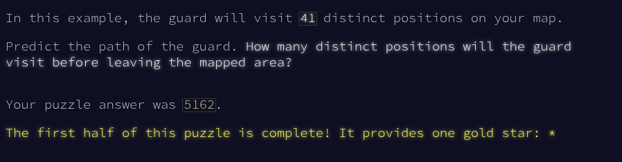

### Advent of Code

2024 Day 6 : Guard Gallivant

Part 1:

- On transforme le fichier en double tableau de chaînes de caractères.
- Puis on récupère la position de départ "^"
- On avance dans la map: s'il y a quelque chose devant à la position actuelle, on tourne à 90, sinon on avance tout droit
- A chaque fois que l'on avance, on stocke la position dans le tableau `distinct_positions` si elle n'est pas présente dans le tableau
- On s'arrête de bouger dès que la fonction move_forward ne met plus à jour notre position.

